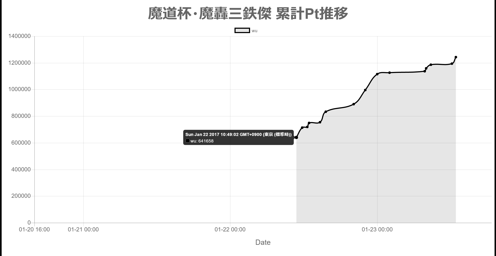

# chart.js sample (html)

[Chart.js](http://www.chartjs.org/)'s sample.

- xAxis: Time Scale
- yAxis: Linear Scale



## Usage

- Clone this repository.
- `cd` to `chartjs-html` directory.
```
$ cd chartjs-html
```
- Install modules.
  - npm
  ```
  npm install
  ```
  - yarn
  ```
  yarn install
  ```
- Run server, and view sample chart.
  - npm
  ```
  npm run start
  ```
  - yarn
  ```
  yarn run start
  ```